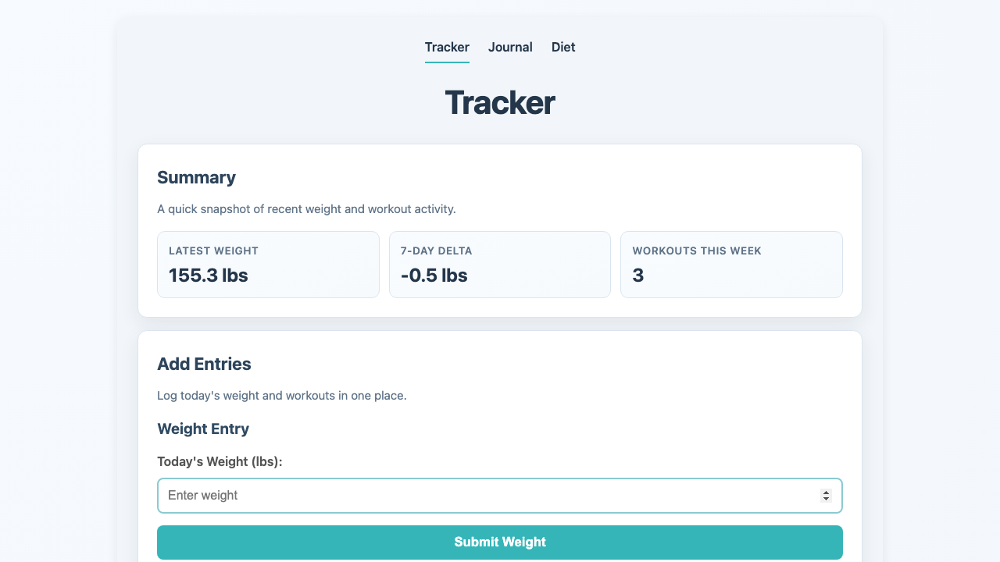

# Health Dash

Local-first health dashboard with:
- Weight tracking + trend chart
- Workout logging + calendar/timeline
- Journal entries (markdown + edit)
- Diet/meal logging + calorie summaries

Data is stored in local JSON/Markdown files under `data/`.

Self-hosting is intended to run with a [Nix flake](https://wiki.nixos.org/wiki/Flakes) and can be made easily accessible to your personal hosts via [tailscale](https://tailscale.com/) or Cloudflare tunnel.

## Tooling

- Python + Flask backend (`uv`)
- TypeScript frontend (`pnpm`)
- Nix + direnv dev shell (`flake.nix`, `.envrc`)
- Just command runner (`justfile`)
- Pytest verification baseline

## Quick Start

```bash
direnv allow
just install
pnpm build
just serve
```

Open: `http://127.0.0.1:5001`


## Preview


